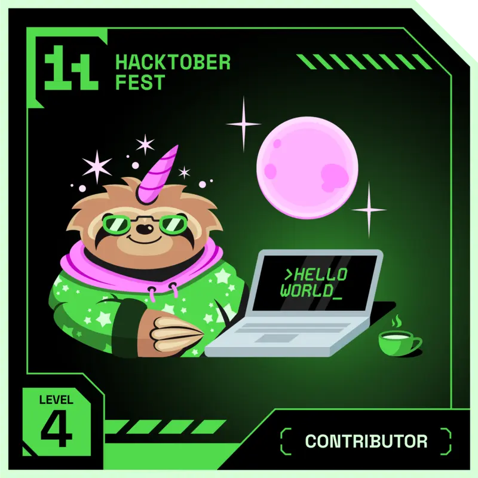

<h1>👋 Hi, I’m Zubaida Sehnaz<h1>
<h2>I am a B.TECH (CSE) student from Galgotias University, India with an interest in working with frontend technologies and nature photography(depending on the sky &#128526;)</h2> 

- <b> GSSOC EXTD 2024 STATS</b> 
  Link - https://gssoc.girlscript.tech/leaderboard?year=2024Extd&username=Zubaida0113
  
<b>GSSOC(24) Badges </b>
 
  

    
    
    
    
    
    
    
 

 - 
<b>Hacktoberfest 2024 Badges</b>
 
 

 
 
 
 
 

<!---
Zubaida0113/Zubaida0113 is a ✨ special ✨ repository because its `README.md` (this file) appears on your GitHub profile.
You can click the Preview link to take a look at your changes.
--->
